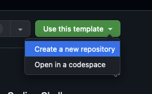

# Try to avoid using AI completion tools.

It defeats the point :)

# Loan Management System

A simple Next.js application for capturing and managing loan details. 

## Features

- Form to capture loan details:
  - Multiple drawdowns (amount and date)
  - Loan term in months
  - Interest rate percentage
  - Interest payment frequency (monthly/quarterly/yearly)
  - Interest accrual frequency (daily/monthly)
  - Bullet loan structure (principal repaid in full at maturity)
- Form validation using Zod
- API endpoints for form submission and data retrieval
- SQLite database for persistent storage
- View saved loans with all details

## Technologies Used

- Next.js 14
- TypeScript
- React Hook Form
- Zod for validation
- SQLite with Drizzle ORM
- shadcn UI components
- Tailwind CSS

## Getting Started

### Prerequisites

- Node.js 18+ and npm

### Installation

1. Clone the repository
2. Install dependencies:

```bash
npm install
```

3. Run the development server:

```bash
npm run dev
```

4. Open [http://localhost:3000](http://localhost:3000) in your browser to see the application.

## Project Structure

- `src/app/page.tsx` - Main page component
- `src/app/loans/page.tsx` - Page to view saved loans
- `src/app/api/loan/route.ts` - API endpoint for loan form submission
- `src/app/api/loans/route.ts` - API endpoint for retrieving loans
- `src/components/LoanForm.tsx` - Main loan form component
- `src/components/DrawdownArrayInput.tsx` - Custom component for managing drawdown inputs
- `src/types/loan.ts` - TypeScript types for loan data
- `src/db/` - Database-related files:
  - `index.ts` - Database connection and initialization
  - `schema.ts` - Database schema definitions
  - `loanService.ts` - Service functions for database operations

## Database

The application uses SQLite for data persistence. The database file is created automatically at the root of the project as `loan-data.db`. The schema includes:

- `loans` table - Stores loan details like term, interest rate, and payment frequencies
- `drawdowns` table - Stores drawdown amounts and dates, linked to loans via foreign key

## Take-Home Test Instructions

### Objective
You have a boilerplate Loan Management System, which currently includes a basic **form** for capturing loan data and an **API** endpoint that receives the same data. Your task is to expand this system to handle **transaction creation** from that input—using **“Actual/365”** simple interest and a **bullet repayment** approach—then use those transactions to generate a repayment schedule. Finally, expose this schedule via a new API endpoint and present it in a minimal UI. Below are the requirements and expectations for the take-home assignment.

### Requirements

#### 1. Transaction Creation

- From the loan data submitted via the existing form or API, **create the necessary transaction records**.  
- Implement **“Actual/365”** simple interest in your transaction logic.
- Use a **bullet repayment** structure
- Each transaction must be persisted in the database and linked to the corresponding loan record.

#### 2. Loan Repayment Schedule

- **Reusing Transactions from the Database**: Retrieve the transactions you created to compute the final repayment schedule.
- **New API Endpoint**: Create an endpoint (e.g., `/api/loans/{id}/schedule`) that returns the repayment schedule (dates, interest amounts, final principal repayment, etc.) derived from the stored transactions.
- **Minimal UI**: Display the repayment schedule in a straightforward table or list, either on a new page or within the existing loan view.

**Required Columns in the Repayment Schedule**

1. **Month** – Identifies the period (e.g., January 2023, February 2023, etc.)  
2. **Drawdowns** – The amount borrowed in that month (if any)  
3. **Interest** – The interest accrued or paid in that month  
4. **Principal Repayment** – Any principal paid off in that month (including the final bullet repayment)
5. Any other columns you feel are important!

#### 3. Testing

1. **Unit Tests**  
   - Confirm that transactions are created correctly based on the loan input.  
   - Verify the interest calculations for different periods and scenarios.

### Evaluation Criteria

Your submission will be evaluated based on:

1. **Code Quality**
   - Clean, maintainable code following best practices
   - Proper error handling and edge case management
   - Effective use of TypeScript for type safety

2. **System Design**
   - Appropriate architecture for the new features
   - Efficient database schema and query design
   - Separation of concerns between UI, API, and business logic

3. **Financial Accuracy**
   - Correct implementation of "Actual/365" interest calculations
   - Proper handling of financial edge cases
   - Accuracy in the generated schedule
   - Precision in decimal calculations

4. **User Experience**
   - Styling isn’t a priority, but user experience is. Make it easy for the user to find and use the new features without confusion.
   - Intuitive UI for viewing complex financial data
   - Appropriate loading states and error handling

### Submission Guidelines

#### Clone this repo

Start off by cloning this repo using the "Use this template" button at the top right and create a new **private** repo:



In the settings of your new private repo, invite `tomwhale` & `stu-dev` as a collaborator. Once finished, drop Tom an email tom [at] ourdomain to let him know!


### Time Expectation
We expect this task to take approximately 4-6 hours for a senior engineer. Please don't spend more than 8 hours on this task.

## License

MIT
